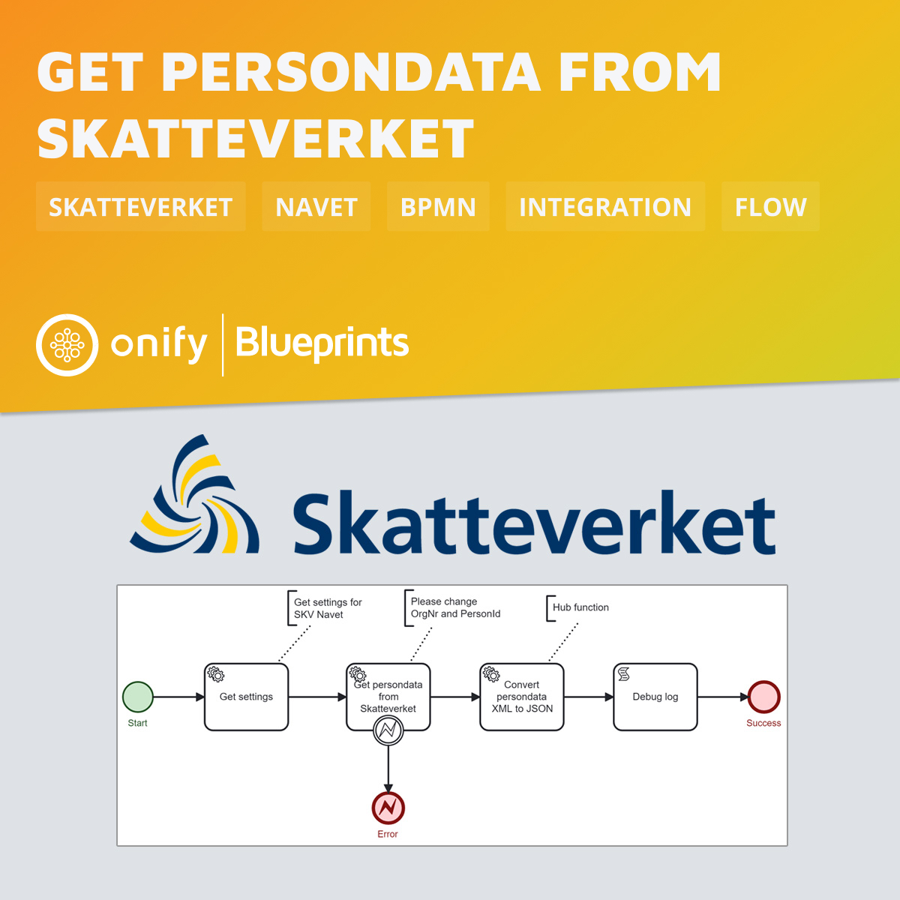

[](https://www.repostatus.org/#wip)


# Onify Blueprint: Get persondata from Skatteverket Navet

The [Navet service](https://skatteverket.se/offentligaaktorer/informationsutbyte/navethamtauppgifteromfolkbokforing.4.18e1b10334ebe8bc80001754.html) offered by Skatteverket provides information on all individuals who are registered (folkbokförda) in Sweden. The data includes names, personal identification numbers, registration addresses, marital status, and relationships.

> Note: Navet is an information service only for public actors, that is to say, authorities, municipalities, and regions. 

This Blueprint shows how Onify can get persondata (by "personnummer") from Skatteverket SOAP web service. 

> Note: This has only been tested against Navets testversion, see [page](https://skatteverket.se/download/18.3016b5d91791bf5467958/1693561618862/na_bilaga10_Handledning_test.docx) for more information.



## Requirements

These are the technical requirements.

* [Onify Hub](https://github.com/onify/install)
* [Onify Hub Functions](https://github.com/onify/hub-functions)
* [Camunda Modeler](https://camunda.com/download/modeler/)
* Certificate via Expisoft

## Setup

### Skatteverket

As mentioned in the requirements, you need a certificate from Expisoft. If you want to test the integration we recommend using the test service and test certificate. 

Here is how you prepare the certificate and test service.

**Get and download certificate**

1. Go to https://eid.expisoft.se/expitrust-test-certifikat/
2. Click and download "Testcertifikat server- och stämpellegitimationer" file
3. Uzip it
4. Open `Kommun A.pdf`
5. Copy "Unika identifieraren" (UID)
6. Copy "PIN-koden" (PASSPHRASE)
6. Go to https://eid.expisoft.se/hamta-e-legitimation/
8. Paste UID
9. Download the file

**Prepare certificate for Onify**

Now when you have downloaded (replace `<FILENAME>` below) the certificate you need to convert it to a base64 so it can be used as a setting in Onify. Here is how you do it in Node.js;

```node
import fs from 'fs';

function toBase64(filePath) {
  const img = fs.readFileSync(filePath);
  return Buffer.from(img).toString('base64');
}

const base64String = toBase64('<FILENAME>.p12');
console.log(base64String);
```

> Note: Keep the base64 string for later...

### Onify

Add the following settings in Onify.

|Key|Value|Type|Tag|Role|
|---|-----|----|---|----|
|skv_navet_cert_base64|`***` (the base64 string, eg. `MIIR***` something)|string|skv, navet|admin|
|skv_navet_cert_passphrase|`***` (this is same as *PIN-koden*, eg. `4729451359506045` for test)|password|skv, navet|admin|
|skv_navet_order_id|`***` (*beställningsidentitet*, eg. `00000236-FO01-0001` for test )|string|skv, navet|admin|
|skv_navet_org_nr|`***` (eg. `162021004748` for test )|string|skv, navet|admin|
|skv_navet_url_persondata|`***` (eg. `https://www2.test.skatteverket.se/na/na_epersondata/V4/personpostXML` for test)|string|skv, navet|admin|

> Note: Creating settings via admin interface add a trailing `_` in key. This is required for flow to work.

## Test

1. Open the BPMN diagram in Camunda Modeler.
2. Deploy the BPMN diagram (click `Deploy current diagram` and follow the steps).
3. Run it (click `Start current diagram`).

## Support

* Community/forum: https://support.onify.co/discuss
* Documentation: https://support.onify.co/docs
* Support and SLA: https://support.onify.co/docs/get-support

## License

This project is licensed under the MIT License - see the [LICENSE](LICENSE) file for details.